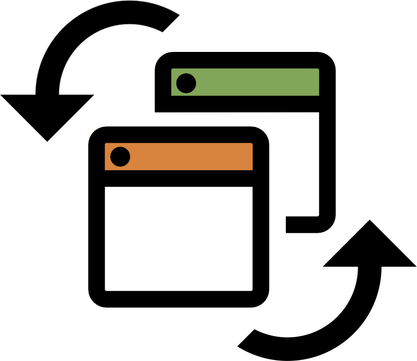

<div align="center">
  
  <h1>OfflineBrowserPubSub</h1>
</div>

**OfflineBrowserPubSub** is a simple JavaScript pub-sub system inspired by [tabsub](https://github.com/simonfrey/tabsub)
using the browsers local storage to send messages between windows and tabs.

## Install

Install with NPM:

```
npm i --save offline-browser-pub-sub
```

Install with Yarn:

```
yarn add offline-browser-pub-sub
```

## Usage

```javascript
// Require offline-browser-pub-sub
import browserPubSub from 'offline-browser-pub-sub'

// Subscribe to a topic
const token = browserPubSub.subscribe('my-topic', message => {
  console.log(message)
})

// Publish to all tabs
browserPubSub.publish('my-topic', 'my-message')

// Publish without notifying the same tab
browserPubSub.publish(
  'my-topic',
  {
    text: 'my-complex-message',
    from: 'me',
    to: 'a friend',
  },
  { notifySameTab: false },
)

// Unsubscribe from a topic
browserPubSub.unsubscribe(token)
```

## Examples

[**Browser Tab Pong**](https://browser-tab-pong.now.sh/): Simple pong game across multiple browser windows.

## Development

After installing the dependencies with `yarn install`, run `yarn dev` to build offline-browser-pub-sub with webpack and serve the example at `http://localhost:5000`.

To install this library onto your local machine, run `npm install`. To release a new version, run `npm version <update_type>` to update the version number in package.json, and then run `npm publish`.

## License

The npm package is available as open source under the terms of the [MIT License](https://opensource.org/licenses/MIT).
